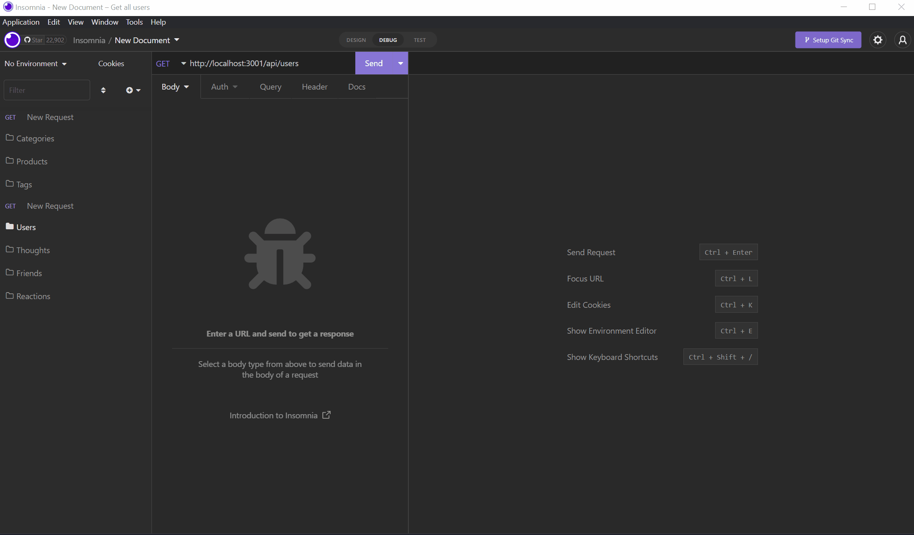

# Social-Network-API

## Description

Back end API code developed for a social network web application using MongoDB, Mongoose, and Express. Code repository can be found [here](https://github.com/Swagnarok630/Social-Network-API).

## Table of Contents

* [Criteria](#criteria)
* [Installation](#installation)
* [Usage](#usage)
* [Contributing](#contributing)
* [Tests](#tests)
* [Questions](#questions)
* [Notes](#notes)
* [License](#license)

## Criteria

* We want a functional Express.js API
* API interacts with Mongoose and MongoDB database
   * Mongoose models provided, seed data to be created by user
* App will sync database with the following models:
   * Users
   * Thoughts
   * Reactions
* API will have proper GET all and GET by ID routes for:
   * Users
   * Thoughts
* API will have proper POST, PUT, and DELETE routes for:
   * Users
   * Thoughts
* API will have proper POST and DELETE routes for:
   * Friends
* API will have proper POST AND DELETE routes for:
   * Reactions
* Users may posts their thoughts, add friends to their list, and react to other thoughts

## Installation Instructions

- Perform an npm install to get all dependencies.
- Run server with "npm run start" command.
- Open Insomnia and use POST routes to create seed data

## Usage

Once the server is running and a few pieces of seed data have been created, Insomnia can be used to view all API routes and ensure correct usage. 

Video showing full use of the application can be found [here](https://www.youtube.com/watch?v=7EuVstEeSRE)

## Contributing

Anyone is welcome to contribute to this project as they see fit, as there can be many more improvements made. Look for my contacts in the upcoming Questions section.

## Tests

No test cases needed.

## Questions

If there are any questions or concerns regarding the app, you may contact me through the following:
* Github - <https://github.com/Swagnarok630>
* E-mail - swagnarok.630@gmail.com

## Notes

### Future Features
* Can probably add validation checks
* Improve update routes to allow more fields to be updated (without erroring)
  * Updates to Reactions
* Add GET routes for Reactions

## License

Copyright (c) Darryl Le. All rights reserved.  
Licensed under [MIT](https://opensource.org/licenses/MIT) license(s).
